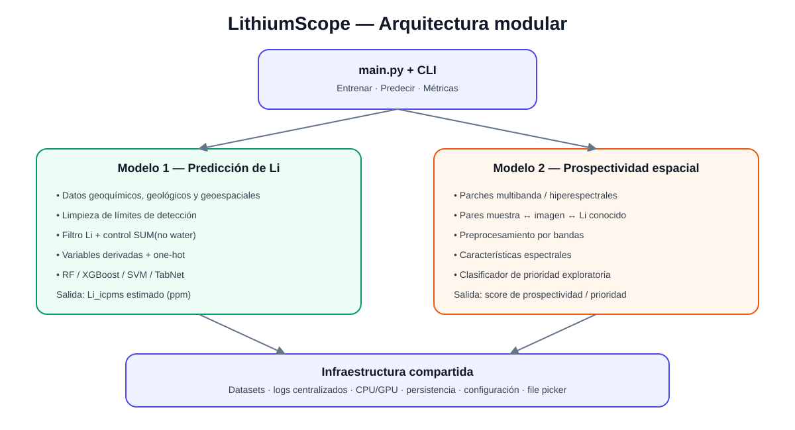
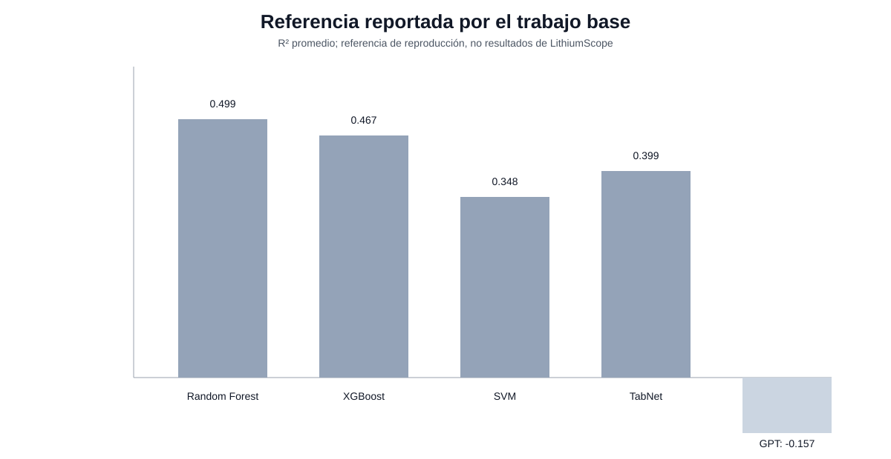
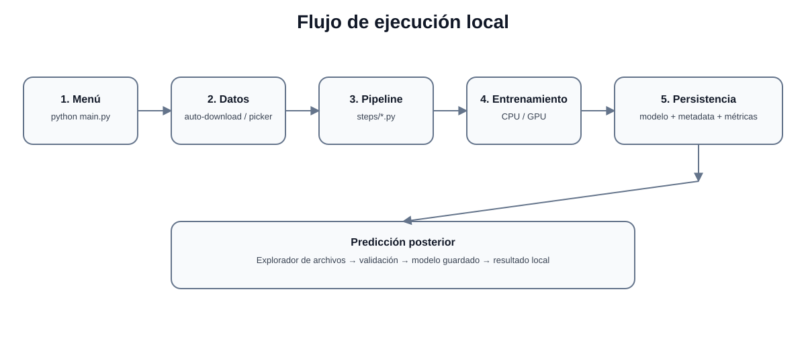
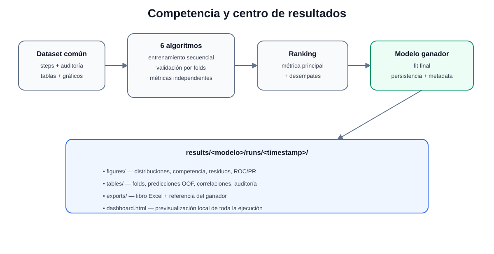

# LithiumScope

> Sistema local, modular y reproducible para predicción de concentración de litio y análisis experimental de prospectividad espacial.

<p align="center">
  
</p>

## 1. Antecedentes

LithiumScope nace como una reconstrucción y extensión de un trabajo académico orientado a **predecir la concentración de litio (`Li_icpms`, ppm) en muestras de roca** a partir de información geoquímica, geológica y geoespacial.

El estudio base trabaja con una tabla donde cada fila representa una muestra y las columnas incluyen:

- óxidos mayores: `SiO2`, `TiO2`, `Al2O3`, `Fe2O3`, `MnO`, `MgO`, `CaO`, `Na2O`, `K2O`, `P2O5`;
- elementos traza: `Th_icpms`, `U_icpms`, `Rb_icpms`, `Cs_icpms`, `Nb_icpms`, `Ta_icpms`, `Pb_icpms`, `Ba_icpms`, `Sr_icpms`, `Zr_icpms`, `V_icpms`, `Hf_icpms`;
- coordenadas;
- edad geológica;
- tipo de muestra;
- tipo de roca;
- arco y dominio;
- `Li_icpms` como variable objetivo.

El documento de referencia informa 2.635 registros iniciales, 787 muestras con `Li_icpms` válido y 681 muestras finales después de los filtros definidos por sus autores.

LithiumScope **no descarga ni reutiliza notebooks**. Cada etapa del procedimiento se traduce a un módulo `.py` independiente, testeable y reutilizable.

### Documentación técnica de datos

- [Variables de entrada y salida](docs/INPUT_OUTPUT_VARIABLES.md)
- [Datasets y features](docs/DATASETS_AND_FEATURES.md)

---

## 2. Qué intenta resolver

LithiumScope separa dos preguntas científicas.

### Modelo 1 — Predicción de Li

**Pregunta:** dadas las propiedades conocidas de una muestra, ¿qué concentración de litio estima el modelo?

Entrada:

```text
geoquímica + geología + coordenadas
```

Salida:

```text
Li_icpms estimado (ppm)
```

### Modelo 2 — Prospectividad espacial

**Pregunta:** a partir de muestras conocidas y de información espectral/multibanda del terreno, ¿qué sectores presentan características compatibles con aquellos asociados a concentraciones relativamente altas de litio?

Entrada:

```text
imagen multibanda + muestra conocida + Li real
```

Salida:

```text
score de prioridad exploratoria
```

El score del Modelo 2 **no debe interpretarse como probabilidad de un yacimiento económicamente viable**.

---

## 3. Utilidad esperada

El Modelo 1 permite reproducir y mejorar el problema predictivo original.

El Modelo 2 busca responder una pregunta operacional posterior:

```text
¿dónde sería razonable mirar, revisar o muestrear después?
```

LithiumScope no pretende reemplazar:

- ICP-MS;
- interpretación geológica;
- trabajo de terreno;
- validación mineralógica;
- evaluación económica de un depósito.

Su utilidad es actuar como herramienta de **apoyo, comparación y priorización**.

---

## 4. Filosofía de implementación

El proyecto sigue una arquitectura de aplicación única y modular:

```text
un programa
+
dos modelos independientes
+
infraestructura compartida
```

No utiliza microservicios y no necesita un servidor para funcionar.

El punto de entrada es:

```bash
python main.py
```

o:

```bash
lithiumscope
```

---

## 5. Menú principal

```text
====================================================
                    LITHIUMSCOPE
====================================================

1. Entrenar modelos
2. Realizar predicción
3. Métricas y resultados
4. Cargar modelo versionado
0. Salir
```

### Opción 1 — Entrenar modelos

Ya no se selecciona un algoritmo individual.

El usuario elige qué **familia de problema** entrenar:

```text
1. Modelo 1 — Competencia de predicción de Li
2. Modelo 2 — Competencia de prospectividad espacial
3. Entrenar ambos
```

Cada competencia entrena sus algoritmos **uno detrás de otro**, registra métricas independientes y genera un ranking reproducible.

### Opción 2 — Realizar predicción

Utiliza el modelo ganador persistido.

- Modelo 1: CSV / XLS / XLSX.
- Modelo 2: GeoTIFF / TIFF / NPY multibanda.

En Windows se abre el explorador de archivos del sistema para seleccionar el archivo.

### Opción 3 — Métricas y resultados

Funciona como un **centro local de resultados**.

Permite:

- abrir el dashboard HTML del último entrenamiento;
- abrir el Excel de resultados;
- listar ejecuciones históricas;
- comparar ejecuciones anteriores;
- identificar ejecuciones aptas como candidatas a publicación;
- generar un manifest y un ZIP local con los modelos entrenados;
- abrir la carpeta completa `results/`.

### Opción 4 — Cargar modelo versionado

Consulta los GitHub Releases del proyecto y muestra únicamente los releases que contienen un asset de modelos compatible (`*-artifacts.zip`).

Al seleccionar uno:

1. descarga únicamente el asset de modelos, nunca los archivos automáticos `Source code` de GitHub;
2. verifica el SHA-256 disponible y los hashes internos de cada modelo;
3. valida el manifest del bundle;
4. comprueba que ambos artefactos pueden deserializarse en el entorno actual;
5. instala Modelo 1 y Modelo 2;
6. los registra como modelos activos para las predicciones posteriores.

Un clon nuevo puede llegar al menú sin descargar los datasets de entrenamiento. Los datasets se preparan recién al elegir la opción de entrenamiento.

---

## 6. Competencia del Modelo 1

LithiumScope replica los cuatro algoritmos principales del trabajo base y agrega dos alternativas tabulares modernas.

### Algoritmos

1. **Random Forest**
2. **XGBoost**
3. **SVM RBF**
4. **TabNet**
5. **HistGradientBoosting**
6. **CatBoost**

Los primeros cuatro permiten comparar directamente con la metodología previa.

HistGradientBoosting y CatBoost se incorporan como nuevas alternativas para evaluar si un método tabular adicional mejora generalización sin cambiar la pregunta científica.

### Validación

Se mantiene el esquema:

```text
Nested Cross Validation
5 folds externos
5 folds internos
seed = 42
```

Cuando Optuna está instalado, la optimización se realiza dentro del conjunto de entrenamiento del fold externo.

### Métricas

La competencia registra por fold:

- RMSE;
- MAE;
- R²;
- Median Absolute Error;
- Explained Variance;
- tiempo de entrenamiento.

Además calcula media y desviación estándar entre folds.

### ¿Cómo se determina el ganador?

Regla principal:

```text
menor RMSE promedio de validación externa
```

Desempates:

1. menor MAE promedio;
2. mayor R² promedio.

El ganador se vuelve a entrenar con todas las muestras disponibles y se persiste para predicción posterior.

Además se evalúa un **baseline trivial** (`DummyRegressor` con la media del conjunto de entrenamiento). El baseline aparece en los resultados para demostrar cuánto aporta el ML, pero no participa como candidato a ganador.

> El ranking es una comparación experimental del conjunto y esquema de validación usados. No demuestra superioridad universal de un algoritmo.

---

## 7. Competencia del Modelo 2

Modelo 2 es un problema distinto y por eso utiliza una competencia distinta.

### Algoritmos

1. Random Forest
2. Extra Trees
3. HistGradientBoosting
4. XGBoost
5. CatBoost
6. SVM RBF

Estos algoritmos trabajan inicialmente sobre características espectrales extraídas de cada parche multibanda.

### Objetivo inicial

El baseline transforma la concentración conocida de Li en una clase relativa:

```text
muestras >= cuantil configurado de Li → referencia de Li alto
muestras < cuantil                    → referencia restante
```

La configuración inicial utiliza el cuantil 0,75.

### Validación

Si el manifiesto contiene `spatial_group`, LithiumScope utiliza:

```text
StratifiedGroupKFold
```

para evitar que observaciones del mismo grupo espacial queden simultáneamente en entrenamiento y validación.

Si los grupos no están disponibles, utiliza `StratifiedKFold` y deja una advertencia explícita en consola y logs.

### Métricas

- ROC-AUC;
- Average Precision;
- Balanced Accuracy;
- F1;
- Precision;
- Recall;
- Brier Score.

### Ganador

1. mayor ROC-AUC medio;
2. mayor Average Precision;
3. mayor Balanced Accuracy.

Modelo 2 también incluye un baseline de prevalencia (`DummyClassifier(strategy="prior")`). Se informa junto con la competencia, pero queda excluido de la selección del ganador.

---

## 8. Proceso reproducido para el Modelo 1

Cada bloque conceptual tiene su propio archivo.

### Step 01 — Carga

`step_01_load_data.py`

Soporta:

- CSV;
- XLS;
- XLSX.

Los CSV se prueban de forma segura con:

1. UTF-8;
2. UTF-8-SIG;
3. Windows-1252;
4. Latin-1.

La codificación seleccionada queda registrada en consola y logs.

### Step 02 — Límites de detección

`step_02_detection_limits.py`

Reglas documentadas:

```text
<10  → 5
>100 → 100
```

### Step 03 — Valores faltantes

`step_03_missing_values.py`

Normaliza representaciones de ausencia y decide la disponibilidad de `Age (Ma)`.

### Step 04 — Filtro de objetivo

`step_05_target_filtering.py`

- elimina `Li_icpms` ausente;
- conserva el intervalo percentil 2,5–97,5.

### Step 05 — Control geoquímico

`step_04_quality_control.py`

Conserva valores del total de óxidos dentro de:

```text
94 <= SUM (no water) <= 102
```

### Step 06 — Categorías

`step_06_category_cleaning.py`

Normaliza y agrupa:

- `Geologycal_age`;
- `Sample_type`;
- `Rock_type`;
- `Arc`;
- `Domain`.

### Step 07 — Ingeniería geoquímica

`step_07_feature_engineering.py`

```text
Alkali_Sum = Na2O + K2O

Mg_Number = MgO / (MgO + Fe2O3 + 1e-6)

A_CNK_proxy = Al2O3 / (CaO + Na2O + K2O + 1e-6)

K_Mg_ratio = K2O / (MgO + 1e-6)
```

### Step 08 — Preprocesamiento

`step_08_preprocessing.py`

- imputación dentro del pipeline;
- OneHotEncoder;
- categorías desconocidas ignoradas;
- StandardScaler cuando corresponde.

### Step 09 — Validación

`step_09_validation.py`

Define los folds y evita mezclar responsabilidades con los algoritmos.

---

## 9. Auditoría del pipeline

Cada etapa imprime en consola y registra en logs:

```text
nombre de etapa
número de filas
número de columnas
cantidad de celdas faltantes
```

Ejemplo conceptual:

```text
✓ 01_load_data                filas=2635 columnas=...
✓ 02_detection_limits         filas=2635 columnas=...
✓ 03_missing_values           filas=2635 columnas=...
✓ 04_target_filtering         filas=...  columnas=...
✓ 05_quality_control          filas=...  columnas=...
✓ 06_category_cleaning        filas=...  columnas=...
✓ 07_feature_engineering      filas=...  columnas=...
```

La auditoría también se exporta a:

```text
pipeline_steps.csv
```

---

## 10. Resultados generados automáticamente

Cada entrenamiento crea una ejecución independiente:

```text
results/
└── model_1/
    └── runs/
        └── YYYYMMDDTHHMMSSZ/
            ├── config/
            ├── manifests/
            ├── figures/
            ├── tables/
            ├── exports/
            ├── run.json
            └── dashboard.html
```

Modelo 2 utiliza la misma convención.

### Figuras del Modelo 1

- distribución de `Li_icpms`;
- porcentaje de datos faltantes;
- pérdida/conservación de muestras por etapa;
- heatmap de correlaciones numéricas;
- RMSE de la competencia;
- real vs. predicho por algoritmo;
- residuos por algoritmo;
- importancia de variables del ganador cuando el algoritmo la expone.

### Tablas

- auditoría del pipeline;
- resumen descriptivo;
- matriz de correlaciones;
- métricas por fold;
- predicciones OOF;
- residuos;
- ranking final.

### Excel

Cada ejecución exporta un libro Excel con:

- ranking;
- auditoría del pipeline;
- resumen del dataset;
- correlaciones;
- métricas por fold;
- predicciones por algoritmo.

### Dashboard local

`dashboard.html` carga automáticamente:

- estado y trazabilidad de `run.json`;
- manifest del dataset y su hash;
- todas las figuras PNG de la ejecución;
- previews de las tablas CSV;
- enlaces a exportaciones Excel;
- resultados organizados por sección.

No necesita servidor web.

---

## 11. Runtime: preboot y cierre seguro

LithiumScope incorpora una capa de ciclo de vida independiente en:

```text
src/lithiumscope/runtime/
├── preboot.py
├── graceful_shutdown.py
└── lifecycle.py
```

### Preboot

Antes de mostrar el menú, `preboot.py` verifica y prepara:

- Python 3.11 o superior;
- dependencias esenciales;
- dependencias ML completas;
- dependencias de imágenes;
- configuración YAML;
- permisos de escritura en `data/`, `models/`, `results/` y `logs/`;
- acelerador CPU / CUDA / MPS;
- estado local del dataset geoquímico del Modelo 1, sin descargarlo durante el arranque;
- estado local del dataset espacial del Modelo 2, sin construir pares Sentinel-2 durante el arranque;
- placeholders `.gitkeep` locales.

Si faltan paquetes opcionales para ejecutar una competencia completa, el preboot los informa de una sola vez y entrega el comando recomendado:

```bat
pip install -e ".[ml,imagery,dev]"
```

Además genera un reporte JSON en:

```text
logs/preboot/preboot_<timestamp>.json
```

Los archivos `.gitkeep` **se mantienen versionados intencionalmente** para que GitHub y un clon recién creado muestren la arquitectura completa de directorios aunque todavía estén vacíos. Al ejecutar LithiumScope, el preboot elimina esos `.gitkeep` únicamente del working tree local, porque en ese momento las carpetas ya existen y comenzarán a contener datos, modelos, logs y resultados reales. Esta limpieza local no elimina los placeholders del repositorio remoto.

### Graceful shutdown

`graceful_shutdown.py` registra manejadores para:

- Ctrl+C / SIGINT;
- SIGTERM;
- Ctrl+Break en Windows;
- cierre de consola de Windows mediante `SetConsoleCtrlHandler`;
- finalización normal del proceso.

El gestor:

1. registra el motivo del cierre;
2. detiene procesos hijo conocidos;
3. espera un tiempo breve;
4. fuerza su terminación solo si no responden;
5. ejecuta callbacks de limpieza;
6. cierra correctamente el sistema de logging.

El selector de archivos ya no utiliza Tkinter. En Windows usa el diálogo nativo de WinForms mediante PowerShell; en macOS usa `osascript`; en Linux intenta `zenity` o `kdialog`. Esto evita mantener un event loop de Tkinter durante entrenamientos largos.

---

## 12. Logs centralizados

```text
logs/
├── lithiumscope.log
├── training/
├── prediction/
└── errors/
```

El log general conserva el flujo completo.

Cada entrenamiento crea además un archivo independiente como:

```text
logs/training/model_1_competition_YYYYMMDD_HHMMSS.log
```

---

## 13. CPU y GPU

`src/lithiumscope/core/device.py`

Prioridad:

```text
CUDA → MPS → CPU
```

El backend se utiliza solo cuando el algoritmo lo soporta.

- scikit-learn Random Forest: CPU;
- scikit-learn SVM: CPU;
- XGBoost: CUDA cuando está disponible;
- CatBoost: GPU cuando está disponible;
- TabNet: CUDA cuando está disponible;
- modelos visuales futuros: acelerador compatible.

Una GPU no es requisito para utilizar LithiumScope.

---

## 14. Datasets

### Modelo 1

Mientras se confirma la fuente oficial, se utiliza como bootstrap un mirror público de `Mamani09_Table_DR2`.

> Este mirror no se presenta como repositorio oficial de los autores del trabajo académico.

### Modelo 2

El dataset de entrenamiento del Modelo 2 se construye **automáticamente**. El usuario no tiene que crear ni seleccionar manualmente un `training_manifest.csv`.

Preboot realiza este flujo:

```text
dataset geoquímico
      ↓
muestras con Li + latitud + longitud
      ↓
búsqueda Sentinel-2 L2A por coordenada
      ↓
selección de escena por nubosidad
      ↓
extracción y cache de parche multibanda
      ↓
data/processed/model_2/training_manifest.csv
```

Las imágenes se obtienen mediante el catálogo público STAC Earth Search y se almacenan como parches locales cacheados. Si una muestra no dispone de escena válida, queda registrada y se omite; el entrenamiento exige un mínimo configurable de muestras preparadas.

El manifiesto generado contiene, entre otros:

- `sample_id`;
- `Li_icpms`;
- longitud;
- latitud;
- `spatial_group`;
- ruta del parche multibanda;
- identificador de escena Sentinel-2;
- nubosidad de la escena.

Fuentes espectrales como Fregeneda–Almendra y GREENPEG continúan registradas como **referencias auxiliares**; no se mezclan automáticamente con las muestras andinas porque corresponden a dominios geológicos diferentes.

---

## 15. Manifiesto automático del Modelo 2

`training_manifest.csv` es un artefacto interno reproducible, no un archivo que el usuario deba preparar.

Ruta predeterminada:

```text
data/processed/model_2/training_manifest.csv
```

Los parches Sentinel-2 se cachean en:

```text
data/raw/model_2/sentinel2/patches/
```

En ejecuciones posteriores, preboot reutiliza el manifiesto y los parches existentes mientras sigan siendo válidos, evitando descargar nuevamente los mismos datos.

---

## 16. Estructura SOLID

La descripción completa está en [docs/SOLID.md](docs/SOLID.md).

Resumen:

```text
step_XX.py      → transforma una etapa
pipeline.py     → ordena etapas
factory.py      → construye algoritmos
cv_runner.py    → valida algoritmos
competition.py  → compara y rankea
artifacts.py    → genera evidencia
persistence/    → guarda/carga modelos
cli/*_command   → casos de uso de consola
menu.py         → solo despacha opciones
```

Se añadieron tests estructurales para impedir:

- introducir notebooks;
- volver a convertir `menu.py` en un archivo monolítico;
- engordar `trainer.py` con responsabilidades ajenas.

---

## 17. Instalación

### Requisito

Python 3.11 o superior.

Verifique su versión:

```bat
python --version
```

### Windows

```bat
git clone https://github.com/JaimeArriagadaRosas/LithiumScope.git
cd LithiumScope

python -m venv .venv
.venv\Scripts\activate

python -m pip install --upgrade pip
pip install -e ".[ml,imagery,dev]"
```

La instalación `.[ml,imagery,dev]` permite probar las seis alternativas de ambas competencias.

### Ejecutar tests

```bat
pytest -v
ruff check src tests main.py
```

### Ejecutar

```bat
python main.py
```

---

## 18. Estructura del repositorio

```text
LithiumScope/
├── config/
├── data/
│   ├── raw/
│   ├── interim/
│   └── processed/
├── docs/
│   ├── assets/
│   └── SOLID.md
├── logs/
├── models/
├── results/
├── src/lithiumscope/
│   ├── cli/
│   ├── core/
│   ├── datasets/
│   ├── runtime/
│   ├── model_1/
│   │   ├── steps/
│   │   ├── training/
│   │   ├── prediction/
│   │   └── evaluation/
│   ├── model_2/
│   │   ├── steps/
│   │   ├── training/
│   │   ├── prediction/
│   │   └── evaluation/
│   ├── persistence/
│   └── results/
└── tests/
```

---

## 19. Representación de la baseline académica

La figura siguiente resume los valores reportados por el documento de referencia. **No corresponde a resultados obtenidos todavía por LithiumScope**.

<p align="center">
  
</p>

| Modelo | R² promedio | RMSE promedio (ppm) |
|---|---:|---:|
| Random Forest | 0.499 | 5.361 |
| XGBoost | 0.467 | 5.528 |
| SVM | 0.348 | 6.124 |
| TabNet | 0.399 | 5.828 |
| GPT* | -0.157 | 6.934 |

* GPT fue evaluado con un esquema diferente y no debe interpretarse como comparación equivalente con la nested CV.

---

## 20. Flujo técnico

<p align="center">
  
</p>

<p align="center">
  
</p>

---

## 21. Estado del proyecto

### Implementado

- arquitectura modular sin notebooks;
- carga robusta CSV/Excel;
- fallback de codificaciones CSV;
- auditoría de steps;
- Modelo 1 con seis algoritmos;
- competencia y ranking;
- nested CV para Modelo 1;
- Modelo 2 con seis algoritmos;
- validación espacial agrupada cuando existe `spatial_group`;
- CPU/GPU detection;
- persistencia del ganador;
- logs centralizados;
- exportación CSV/Excel;
- dashboard HTML local;
- gráficos automáticos;
- selector nativo de archivos sin Tkinter;
- preboot de dependencias/configuración/permisos;
- graceful shutdown multiplataforma;
- `.gitkeep` versionados para representar la arquitectura y limpieza local de esos placeholders durante preboot;
- tracking de experimentos mediante `run_id` y `run.json`;
- manifest SHA-256 de datasets por ejecución;
- snapshots de configuración;
- modelos autocontenidos por `run_id`;
- baselines científicos;
- tests automáticos contra leakage y OOF incompleto;
- perfil de aplicabilidad / fuera de dominio;
- comparación de ejecuciones y preparación de candidatos para futuros tags;
- tests funcionales y estructurales;
- CI con GitHub Actions.

### Pendiente de validación científica

- confirmar el dataset oficial del trabajo de origen;
- comparar resultados reales contra la baseline documentada;
- contrastar los pares automáticos muestra ↔ Sentinel-2 con criterios geológicos;
- evaluar y refinar reglas de adquisición Sentinel-2;
- definir agrupación espacial apropiada con geólogos;
- evaluar sensibilidad a tamaño de parche y sensor;
- validar prospectividad con ubicaciones completamente separadas.

---

## 22. Criterio de éxito

Primera etapa:

```text
procedimiento académico
        ↓
reproducción modular
        ↓
competencia de 6 algoritmos
        ↓
métricas y evidencia
        ↓
modelo ganador persistido
        ↓
predicción local
```

Segunda etapa:

```text
muestras georreferenciadas
        +
imágenes espectrales
        ↓
competencia de prospectividad
        ↓
validación espacial
        ↓
priorización de sectores
```

LithiumScope debe mantener siempre una separación explícita entre **reproducción**, **mejora** y **experimentación**.


---

## 23. Reproducibilidad, manifests y artefactos

Cada entrenamiento es un experimento identificado por un `run_id`.

Además de métricas y gráficos, LithiumScope captura:

- commit Git;
- versiones de Python y librerías;
- recursos CPU/GPU;
- configuración exacta;
- hash SHA-256 del dataset;
- estado de la ejecución;
- eventos de algoritmos completados o fallidos;
- ganador y métrica primaria.

Los modelos nuevos se almacenan como artefactos autocontenidos:

```text
models/<modelo>/trained/<run_id>/
├── model.joblib
├── metadata.json
├── feature_schema.json
├── training_config.yaml
└── dataset_manifest.json
```

Los loaders mantienen compatibilidad con artefactos antiguos.

La documentación detallada está en [docs/REPRODUCIBILITY.md](docs/REPRODUCIBILITY.md).

### Aplicabilidad de una predicción

Modelo 1 y Modelo 2 guardan un perfil empírico de los rangos observados durante entrenamiento. Las predicciones indican qué fracción de variables cae fuera del intervalo percentil 1–99 de ese entrenamiento.

Esto funciona como **advertencia de extrapolación**, no como garantía estadística ni geológica.

Modelo 1 agrega además un intervalo empírico basado en el percentil 90 del error absoluto out-of-fold del ganador.

---

## 24. Estrategia para el primer tag

No se crea ningún tag automáticamente.

Después de conseguir una ejecución completa y revisar que no haya errores:

```text
entrenamiento completo
        ↓
run Modelo 1 = completed
run Modelo 2 = completed
        ↓
mismo commit Git
        ↓
hashes de datasets presentes
        ↓
revisión manual de métricas/logs
        ↓
release_manifest.json
        ↓
tag GitHub
```

Desde la opción **3. Métricas y resultados** puede evaluarse el candidato local. Esa acción solo genera un manifest; no modifica GitHub.

La estrategia completa está en [docs/VERSIONING.md](docs/VERSIONING.md).

---

## 25. CI y compatibilidad

La integración continua prueba:

- Ruff;
- Python 3.11, 3.12 y 3.13;
- Ubuntu;
- Windows.

Esto es especialmente importante porque LithiumScope utiliza rutas, selectores de archivos, señales y comportamiento de consola que pueden variar entre sistemas operativos.

`pyproject.toml` es la única fuente de dependencias del proyecto; se eliminó el `requirements.txt` duplicado.


---

## 26. Reanudación de entrenamiento

LithiumScope evita generar carpetas y modelos repetidos cuando una competencia se interrumpe.

Cada entrenamiento nuevo recibe una identidad local como:

```text
training_20260919_154100_m0300
```

Antes de crear una ejecución nueva se calcula una firma con el dataset, las configuraciones relevantes y el commit Git. Si existe un entrenamiento compatible, se reutiliza.

La reanudación opera en varios niveles:

- ejecución completa: si ya terminó, se reutiliza sin volver a generar el modelo;
- algoritmo: conserva sus resultados y parámetros finales;
- fold: un fold terminado no vuelve a ejecutarse;
- Optuna: los estudios se persisten en SQLite y continúan los trials pendientes.

Una interrupción dentro de un fold solo obliga a repetir el trabajo que todavía no había alcanzado un checkpoint seguro.

### TabNet

TabNet utiliza una validación interna tomada exclusivamente del conjunto de entrenamiento de cada fit para que el early stopping sea real y no utilice el fold externo de prueba. Los warnings de la librería se capturan y deduplican en los logs, mientras la consola usa progreso reescribible.

El modelo final ganador puede reajustarse con todos los datos usando el número de épocas seleccionado durante la validación interna.

La estrategia de versionado asociada se documenta en [docs/VERSIONING.md](docs/VERSIONING.md).


### Predicción integrada

Dentro de `2. Realizar predicción`:

```text
1. Modelo 1 — Predicción de concentración
2. Modelo 2 — Prospectividad espacial
3. Predicción completa
4. Demostración integrada automática
0. Volver
```

La predicción completa solicita los inputs del usuario para ambos modelos. La
demostración utiliza un conjunto externo versionado y obtiene automáticamente
Sentinel-2 para los mismos casos. Ambas conservan los modelos científicamente
separados y realizan la integración después de predecir, generando métricas,
correlaciones, concordancias, diagnósticos, Excel, PDF, manifest e
interpretación reproducible. El PDF se abre automáticamente en el navegador
predeterminado del sistema cuando la ejecución finaliza.

Consulte `docs/PREDICTION_WORKFLOWS.md` para el contrato científico y los
artefactos generados.


### Reparación automática de dependencias

`python main.py` verifica y repara dependencias runtime faltantes dentro de un
entorno virtual antes de cargar la aplicación. Solo instala extras ML/imagery
cuando son necesarios y no modifica automáticamente el Python global.
